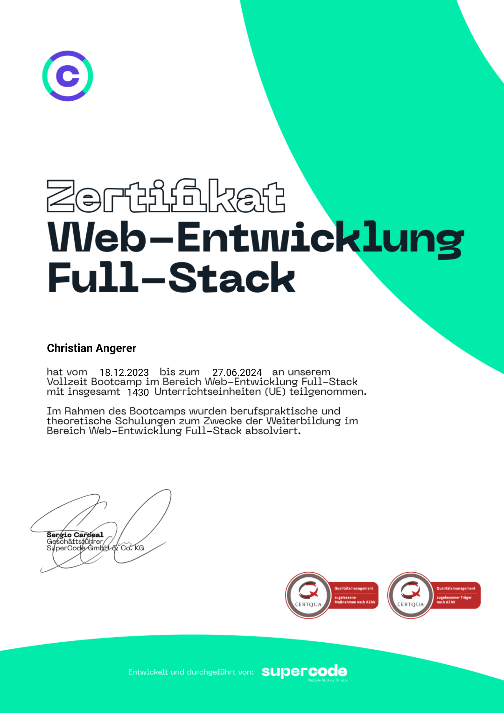

 

	

<!-- MAILTO -->

	<a href="mailto:">E-Mail Contact</a>

<!-- INTRO -->

	
Hello, I’m Chris – a passionate software developer focused on modern web technologies. After making a career at the movies I change into IT, I have successfully completed several challenging projects. My latest and most important project is the personal website of the artist gesinegrundmann.org, for which I was responsible for the entire design and technical implementation.

 

 <h2>🔥Skills🔥</h2>

 

<!-- SKILLS -->

<table style="text-align: center;">
  <tbody>
    <tr align="center">
      <td align="center"></td>
      <td align="center"></td>
      <td align="center"></td>
    </tr>
    <tr>
      <td align="center"></td>
      <td align="center"></td>
      <td align="center"></td>
    </tr>
    <tr>
     <td align="center"></td>
     <td align="center"></td>
      <td align="center"></td>
    </tr>
    <tr>
      <td align="center"></td>
      <td align="center"></td>
      <td align="center"></td>
    </tr>
    <tr>
      <td align="center"></td>
      <td align="center"></td>
      <td align="center"></td>
    </tr>
    <tr>
      <td align="center"></td>
      <td align="center"></td>
      <td align="center"></td>
    </tr>
    <tr>
      <td align="center" colspan="3" style="padding-top: 8px">
	 
          
        
<strong>Manual Deployment</strong>

        
gesinegrundmann.org is deployed directly on private servers without automated platforms like Vercel

       
      </td>
    </tr>
  </tbody>
</table>

 <h2>Activity</h2>

 

 
<!-- MOST USED LANGUAGES + STATS -->

	

 

 <h2>✨Portfolio✨</h2>

 
 

<table style="border-collapse: collapse; width: 100%;">
  <tbody>
    <tr>
      <td style="border: none;" align="center">
        <table>
          <tr>
            <th>
              <a style="color:white; background-color: red; padding: 5px 8px;" 
                 href="https://gesinegrundmann.org" 
                 target="_blank">
                GesinneGrundmann Website
              </a>
            </th>
          </tr>
          <tr>
            <td>
		<a style="color: green !important" 
                 href="https://github.com/ChrissQAng/gesineGrundmannWebside" 
                 target="_blank">
              
ReactJS Vite

              
Node.js

              
PayloadCMS

              
Deployment on debian server

              
with apache2

              
-Responsive-

	        </a>
            </td>
          </tr>
        </table>
      </td>
    </tr>
    <tr>
      <td style="border: none;" align="center">
        <table>
          <tr>
            <th>
              <a style="color:white; background-color: red; padding: 5px 8px;" 
                 href="https://silentmoon.superprojekte.de/" 
                 target="_blank">
                silentMoon
              </a>
            </th>
          </tr>
          <tr>
            <td>
              
ReactJS Vite

              
Node.js

              
Tailwind CSS

              
Mongoose

              
Spotify API

            </td>
          </tr>
        </table>
      </td>
    </tr>
    <tr>
      <td style="border: none;" align="center">
        <table>
          <tr>
            <th>
              <a style="color:white; background-color: red; padding: 5px 8px;" 
                 href="https://free2-game-v2.vercel.app/" 
                 target="_blank">
                FREE4GAME
              </a>
            </th>
          </tr>
          <tr>
            <td>
              
ReactJS Vite

              
Node.js

              
MongoDB

            </td>
          </tr>
        </table>
      </td>
    </tr>
    <tr>
      <td style="border: none;" align="center">
        <table>
          <tr>
            <th>
              <a style="color:white; background-color: red; padding: 5px 8px;" 
                 href="https://headphones-ne8j.onrender.com/" 
                 target="_blank">
                Headphones
              </a>
            </th>
          </tr>
          <tr>
            <td>
           
HTML5

              
CSS

              
Deployment with Render

            </td>
          </tr>
        </table>
      </td>
    </tr>
    <tr>
      <td style="border: none;" align="center">
        <table>
          <tr>
            <th>
              <a style="color:white; background-color: red; padding: 5px 8px;" 
                 href="https://github.com/ChrissQAng/zwitscher/tree/main" 
                 target="_blank">
                zwitscher
              </a>
            </th>
          </tr>
          <tr>
            <td>
              
ReactJS Vite

              
Node.js

              
Tailwind CSS

            </td>
          </tr>
        </table>
      </td>
    </tr>
    <tr>
      <td style="border: none;" align="center">
        <table>
          <tr>
            <th>
              <a style="color:white; background-color: red; padding: 5px 8px;" 
                 href="#" 
                 target="_blank">
                Fitness-App
              </a>
            </th>
          </tr>
          <tr>
            <td>
              
VUE

              
JavaScript

            </td>
          </tr>
        </table>
      </td>
    </tr>
  </tbody>
</table>

  </tbody>
</table>

---

 <h2>📃Certification📃</h2>

 

 

- 💻 Certification: Fullstack development (MERN) bootcamp at <a href="https://www.super-code.de/" target="_blank">"Supercode"</a>
 

 

 

---

 <h2>🔠Languages🔠</h2>

 

 
	
- 🗣️ I speak fluent German and English.

---

 

 

